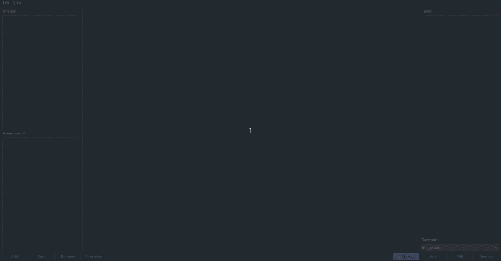

Image manipulation tool written in python in
which you can select a large number of photos and
perform a lot of different operations on them.
---
The current list of operations

- **Resize** - resizes the images to the given resolution or by a specified percentage.
- **Compress** - compresses the image. The lower the 'quality',
  the smaller the file size.
- **Invert** - inverts the colors of the image.
- **Flip** - flips the image in horizontal or vertical axis.
- **Color detection** - marks where the given color appears in the image.
  Additionally, it can save the **mask** in .png format,
  **shapefile** and **geojson** file.
- **Convert** - converts the image to the other format.

## How to use

